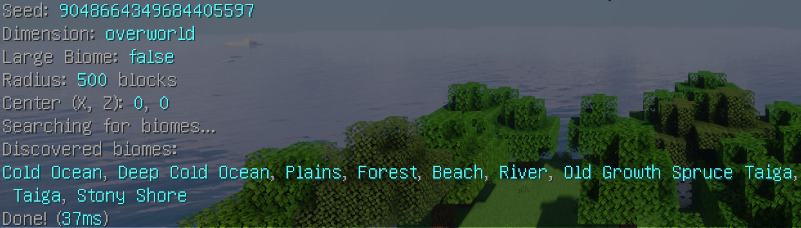
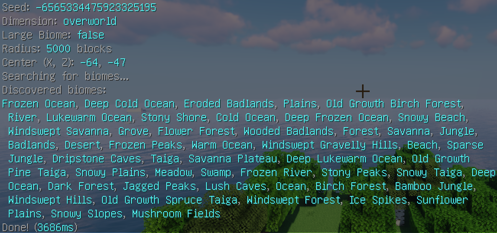
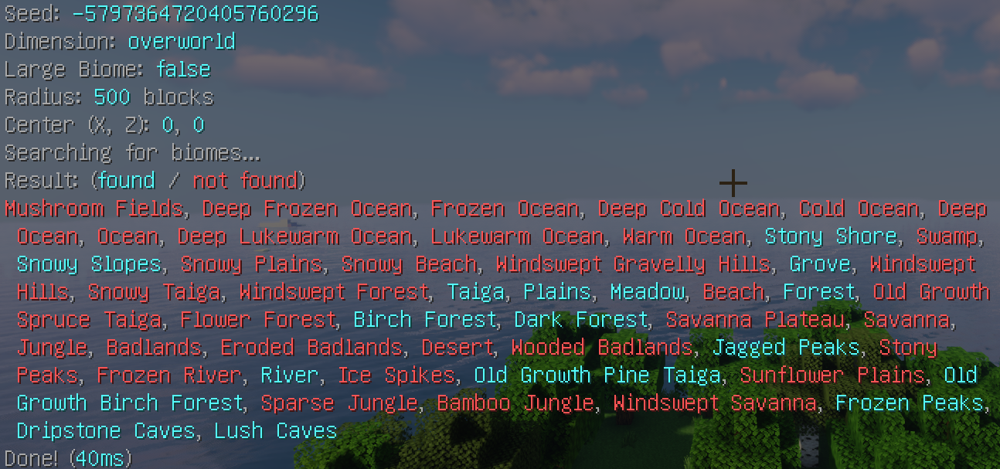
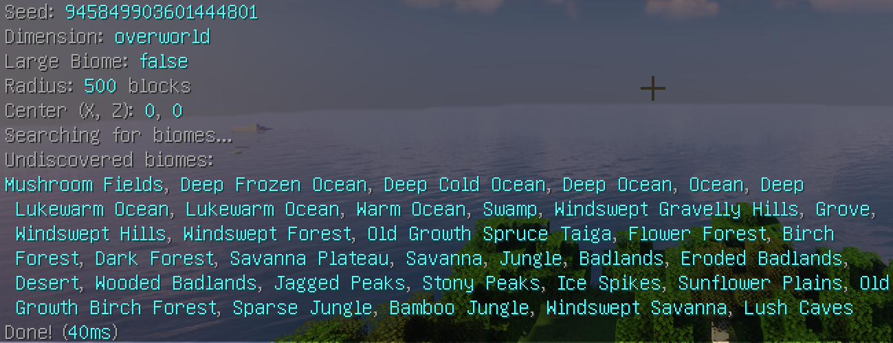

# BiomeFinder

A Paper plugin to search for biomes included in the range.

## Requirements

- Java 21
- Paper or its forks

## Installation

- Download the Jar file from [Releases](https://github.com/Siroshun09/BiomeFinder/releases).
- Move the downloaded jar to the `plugins` directory
- Restart the server

## Usage

Command: `/findbiomes` (`/fb`)

### Arguments

- `help` - Shows the help
- `--seed <seed>` (`-s <seed>`) - Specifies the seed (default: random value)
- `--dimension <overworld/nether>` (`-d <overworld/nether>`) - Specifies the dimension
- `--large` (`-l`) - Enables large biomes
- `--radius <radius>` (`-r <radius>`) - Sets the radius
- `--center-x <x>` (`-x <x>`) - Sets the center x (default: 0)
- `--center-z <z>` (`-z <z>`) - Sets the center z (default: 0)
- `--current-location` (`-cl`) - Sets the center x and z to the current location (player only)
- `--current-world` (`-cw`) - Uses the seed of the current world (player only | center x and z are set to the spawn location if not set)
- `--world <world name>` (`-w <world name>`) - Uses the seed of the specified world and sets center x and z are set to the spawn location
- `--show-all-biomes` (`-sab`) - Shows all biomes list (aqua = found, red = not found biome)
- `--show-discovered-biomes <true/false>` (`-sdb <true/false>`) - Shows found or not found biomes (default: true)

TIP: The search process is asynchronous, so it generally does not stop the server process!

### Examples

- `/fb`

- `/fb -cl -cw -r 5000`

- `/fb -sab`

- `/fb -sdb false`

## License

This project is under the GPL-3.0 license. Please see LICENSE for more info.

Copyright © 2020-2026, Siroshun09
